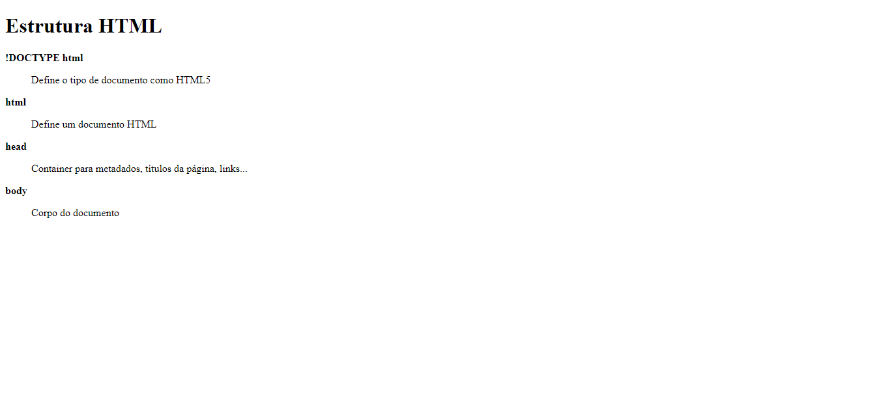
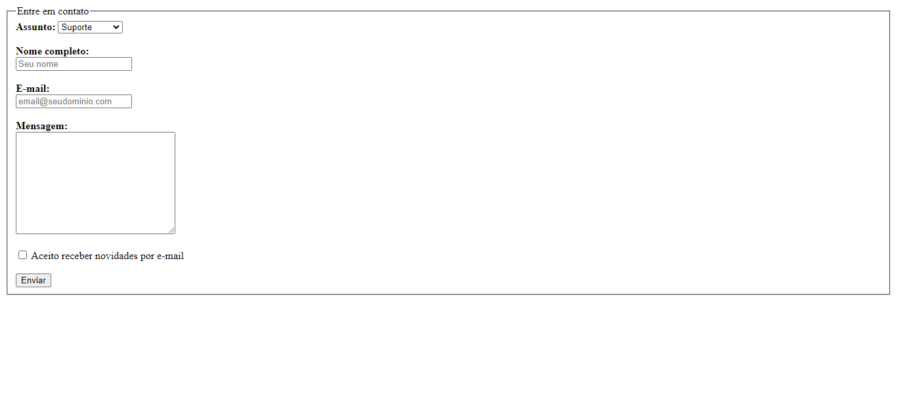
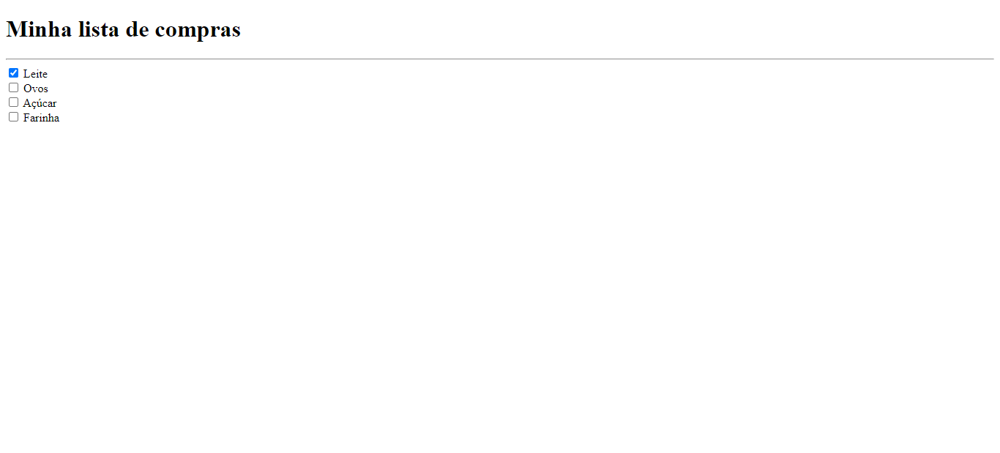
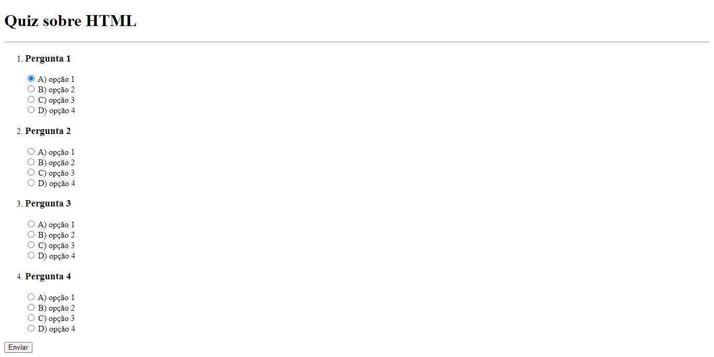
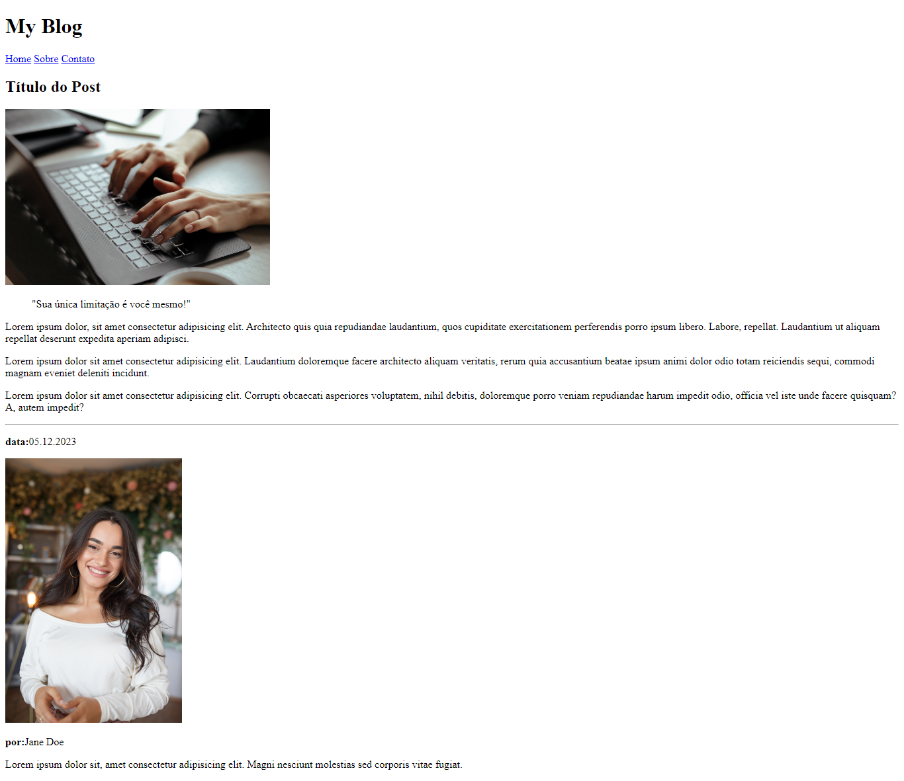

<h1 align="center"> Desafios HTML</h1>

Série de desafios básicos para praticar conhecimentos em HTML.

 

## 🛠 Tecnologias

Esse projeto foi desenvolvido com as seguintes tecnologias:

- HTML e CSS

## 💻 Projeto

- 1. Glossário

Nesse desafio você deve criar um glossário com com no mínimo 4 tags HTML e suas definições.

- 2. Formulário de contato

Nesse desafio você vai criar um formulário para contato.

- 3. Lista de compras

Nesse exercício você deve criar uma lista de compras que tenha no mínimo 4 itens.

- 4. Quiz

Nesse desafio você deve criar um quiz de perguntas e respostas.

- 5. Blog Post

Nesse desafio você deve criar a estrutura HTML para a página de post de um blog.

## 📝 Licença

Esse projeto está sob a licença MIT.

## 🙋🏻‍♂️ Autor

Feito com 💙 por Murillo Ressineti.

