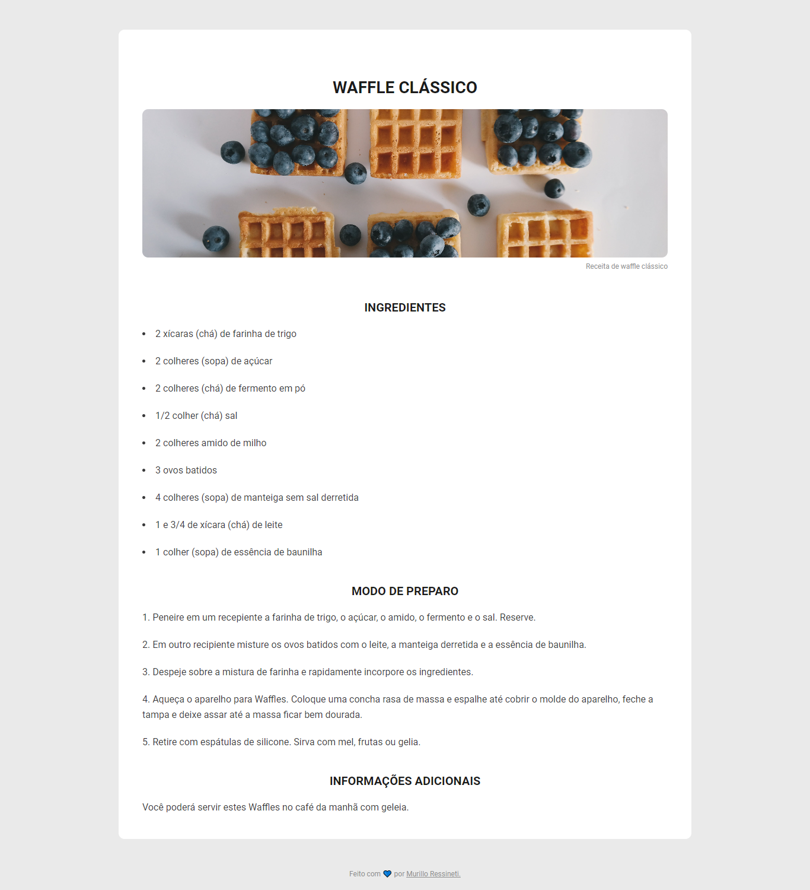

<h1 align="center"> Página de Receita </h1>

Página de Receita proposto em forma de desafio pela Rocketseat. Nesse projeto trabalhei utilizando listas ordenadas e não ordenadas.

 

## 🛠 Tecnologias

Esse projeto foi desenvolvido com as seguintes tecnologias:

- HTML e CSS

## 💻 Projeto

## 📝 Licença

Esse projeto está sob a licença MIT.

## 🙋🏻‍♂️ Autor

Feito com 💙 por Murillo Ressineti.

